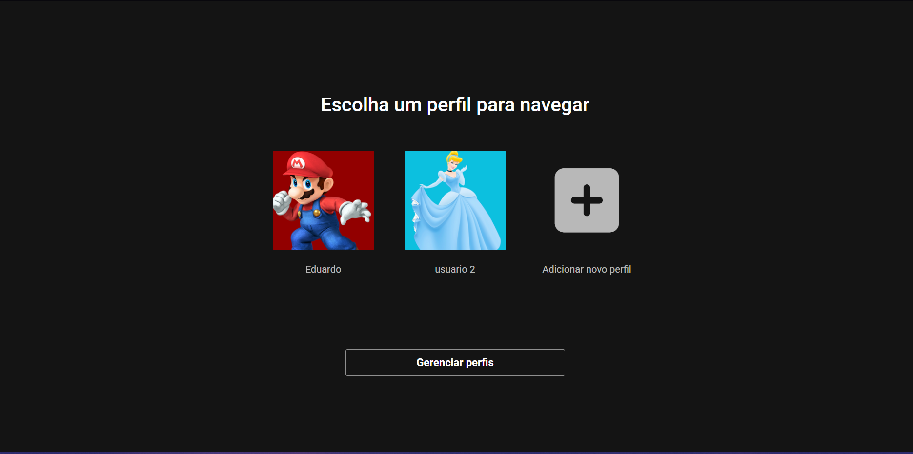
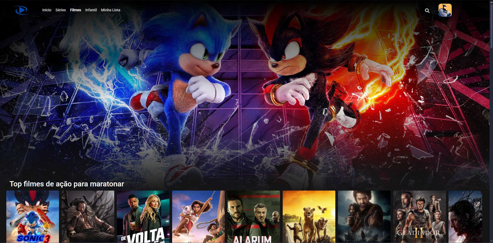

# 🎬 Vicuna Cine

**Vicuna Cine** é uma plataforma web de filmes e séries, onde você pode buscar títulos, ver trailers, descrições, informações completas, além de criar perfis, curtir conteúdos e salvar títulos na sua lista pessoal.

---

## 🚀 Funcionalidades

- 🔍 Pesquisa de filmes e séries por nome  
- 🎞️ Exibição de trailers e informações detalhadas  
- ❤️ Sistema de curtidas e favoritos  
- ✅ Adicionar títulos à sua lista pessoal  
- 👤 Sistema de perfis de usuário  
- 🔐 Sistema de login e cadastro de usuários  
- 🔗 Integração com a API do [TheMovieDB](https://www.themoviedb.org/)

---

## 🛠️ Tecnologias utilizadas

### Backend:
-  Python  
-  Flask  
-  MySQL  
-  Peewee ORM  


### Frontend:
-  HTML5  
-  CSS3  
-  JavaScript  

### Integrações:
- [TMDB API](https://developers.themoviedb.org/)

---

## 💾 Banco de Dados

O banco de dados do projeto está estruturado para suportar funcionalidades como usuários, filmes, listas pessoais, curtidas e informações dos títulos.

### Arquivo do banco:
- O arquivo `dbvicunacine.bd` contém o **dump** (backup) do banco MySQL usado no projeto.

### Como importar o banco:

1. Abra seu gerenciador MySQL (phpMyAdmin, MySQL Workbench, ou terminal).  
2. Crie um banco de dados vazio com o nome `dbvicunacine`.  
3. Importe o arquivo `dbvicunacine.bd` para esse banco, que vai criar as tabelas e inserir dados iniciais.  

---

## 💻 Como rodar o projeto

### Pré-requisitos
- Python 3.x  
- MySQL  
- Virtualenv (opcional, mas recomendado)  

### Setup:
```bash
# Clone o repositório
git clone https://github.com/seuusuario/vicuna-cine.git
cd vicuna-cine

# Crie um ambiente virtual
python -m venv venv
source venv/bin/activate  # Linux/Mac
venv\Scripts\activate     # Windows

# Instale as dependências
pip install -r requirements.txt

# Execute a aplicação
python main.py
```
## 📸 Fotos da aplicação




